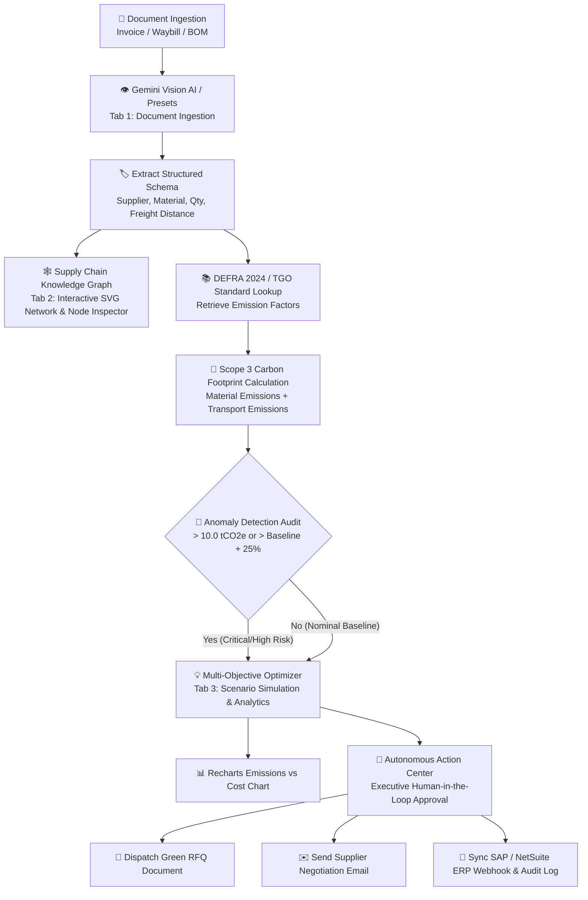

# 🌿 GreenScope Concierge
> **Minimal, Production-Grade Scope 3 Carbon Accounting & Green Procurement AI Agent**

GreenScope Concierge เป็นระบบ AI Agent อัจฉริยะสำหรับบริหารจัดการข้อมูลคาร์บอนฟุตพริ้นท์ของห่วงโซ่อุปทาน (Scope 3 GHG Emissions) ในระดับองค์กร ออกแบบตามมาตรฐาน **Linear/Vercel Design System** (Dark Zinc Aesthetic) เน้นความเรียบหรู สะอาด สวยงาม และแสดงข้อมูลอย่างมีประสิทธิภาพ ตั้งแต่การนำเข้าเอกสารจัดซื้อ, การประมวลผลด้วย Gemini Vision AI, การสร้าง Supply Chain Knowledge Graph, การวิเคราะห์ความเสี่ยงตามมาตรฐาน DEFRA/TGO ไปจนถึงการตัดสินใจดำเนินการจัดซื้อจัดจ้างสีเขียว (Green RFQ) และการซิงค์ข้อมูลกับระบบ ERP

---

## 🏛️ สรุปสถาปัตยกรรม 3-Tab Multi-View Navigation

ระบบถูกออกแบบใหม่ให้แบ่งมุมมองออกเป็น 3 Tabs หลัก เพื่อลดความแออัดของหน้าจอและเพิ่มพื้นที่แสดงผลอย่างเต็มประสิทธิภาพ:

```text
+-----------------------------------------------------------------------------------+
|  GREENSCOPE.AI // SCOPE-3 ENGINE    [01. INGESTION]  [02. GRAPH]  [03. ACTIONS]   |
+-----------------------------------------------------------------------------------+
```

### 1. 📑 Tab 1: `[01. DOCUMENT INGESTION & TECHNICAL INSPECTOR]`
- **Demo Document Presets:** เลือกทดสอบนำเข้าเอกสารจำลองล่วงหน้า 3 รูปแบบ:
  1. *Supplier A - Thai Plastics Industry (Rayong → Chonburi):* 2,000 kg Virgin PP @ ฿50/kg = ฿100,000 THB (🔴 High Carbon Anomaly: 3.28 tCO2e)
  2. *Supplier B - Thai EcoPolymer Solutions (Samut Prakan → Chonburi):* 4,000 kg rPP @ ฿58/kg = ฿232,000 THB (🟡 Moderate Footprint: 3.14 tCO2e)
  3. *Supplier C - Thai BioPack Packaging (Saraburi → Chonburi):* 3,000 kg Corrugated Packaging @ ฿25/kg = ฿75,000 THB (🟢 Nominal Baseline: 2.88 tCO2e)
- **Custom File Upload:** รองรับการลากวาง (Drag & Drop) ไฟล์ PDF/PNG/JPG ชนิด Invoices, BOMs และ Waybills
- **Gemini Vision AI Engine:** สกัดข้อมูลโครงสร้าง JSON (Pydantic/TypeScript Schema) เช่น `supplierName`, `materialName`, `quantity`, `transportMode`, `distanceKm`, `totalCostUSD`
- **Technical Sheet Inspector:** แสดงผลการตรวจสอบเอกสารสเปกอย่างละเอียด หรือเลือกสลับดู **Raw Extracted JSON** ได้ทันที

### 2. 🕸️ Tab 2: `[02. SUPPLY CHAIN KNOWLEDGE GRAPH]`
- **Spacious SVG Topological Network Graph:** ผังโครงข่ายความสัมพันธ์ความละเอียดสูงระหว่าง:
  $$\text{Tier-1 Supplier} \xrightarrow{\text{TRANSPORTED\_BY}} \text{Logistics Carrier} \xrightarrow{\text{IN\_PRODUCT}} \text{Production Line}$$
  $$\text{Material Specification} \xrightarrow{\text{EMITS}} \text{Scope 3 Carbon Audit Outcome}$$
- **Interactive Node Selection:** กดเลือก Node เพื่อดูรายละเอียดในแถบ **Node Telemetry Inspector** ด้านล่าง (4-Column Monospace Data Strip)
- **Anomaly Highlight:** Node ที่ปล่อยคาร์บอนเกินเกณฑ์จะเน้นด้วยขอบสีแดง (`border-rose-800 font-bold`) โดยไม่มีเอฟเฟกต์ไฟนีออนหรือวงกลมลอยที่ไม่เป็นระเบียบ

### 3. 📊 Tab 3: `[03. SCENARIO ANALYTICS & AUTONOMOUS ACTIONS]`
- **Live Google Sheets ERP Integration:** เชื่อมต่อฐานข้อมูลจัดซื้อแบบสดผ่าน Google Sheets:
  - 🔗 **Google Sheet ERP Database:** [เข้าสู่ตารางฐานข้อมูล Google Sheet ↗](https://docs.google.com/spreadsheets/d/17_0MgXv54ILWUctKkreuiAwekj0mDMShWprgbpmXLH4/edit?gid=0#gid=0)
  - เชื่อมต่อผ่าน API Proxy Server (`/api/sheets`) ขจัดปัญหา Browser CORS
  - เมื่อแก้ไขราคา `price_per_kg`, ค่า `emission_factor`, `transport_mode`, `certifications` หรือ `location` ใน Google Sheet ระบบจะคำนวณใหม่และอัปเดตทั้งการ์ดและกราฟแบบ Real-time เพียงกด **`↻ Re-sync Sheet Data`**
- **Multi-Objective Scenario Matrix:** เปรียบเทียบทางเลือกจัดซื้อสีเขียว (เช่น *EcoPolymer Solutions Ltd* ที่ใช้เม็ด rPP ขนส่งด้วยรถไฟไฟฟ้า และ *GreenTech Materials* เม็ดพลาสติกชีวภาพ)
- **Recharts Scenario Simulation:** กราฟแท่งเปรียบเทียบระหว่างสภาวะปัจจุบัน (Baseline Scenario) กับสภาวะพึงประสงค์ (Green Scenario) ในมิติของ **Emissions (tCO2e)** และ **Cost (฿ THB / $ USD)**
- **GHG Protocol DEFRA / TGO Audit Database:** ตารางอ้างอิงค่า Emission Factors มาตรฐาน ( Virgin PP `1.63 - 2.10 kgCO2e/kg`, rPP `0.50 - 0.78 kgCO2e/kg`, Electric Rail Freight `0.028 kgCO2e/tonne-km`)
- **Copilot 3-Tier Audit Card:**
  - 🔴 **HIGH SEVERITY:** Carbon Anomaly Flagged (Virgin PP Resin) แสดงกล่อง Trade-off (Carbon vs Cost vs Lead Time)
  - 🟡 **MEDIUM SEVERITY:** Moderate Footprint Audit (Recycled rPP Resin) แสดงแถบ Circular Material Verified (Balanced)
  - 🟢 **LOW SEVERITY:** Nominal Baseline Audit (Packaging Cardboard) แสดงแถบ ESG Compliant (Optimal)
- **Autonomous Action Center:**
  - 📄 **Generate Green RFQ:** สร้างเอกสารขอเสนอราคาการจัดซื้อจัดจ้างสีเขียว ระบุโหมดขนส่ง สถานที่ และการรับรองมาตรฐานสากล
  - ✉️ **Draft Negotiation Email:** ร่างอีเมลเจรจาขอใบรับรองคาร์บอนฟุตพริ้นท์ (CFP) จากซัพพลายเออร์
  - 🚀 **Dispatch ERP Webhook:** ส่งข้อมูลสั่งซื้อใหม่ไปยังระบบ SAP S/4HANA / NetSuite ERP พร้อมเก็บบันทึก Audit Trail Log

---

## 🔄 ภาพรวมการทำงานของระบบ (System Workflow Diagram)



---

## 🎨 การออกแบบ UI/UX (Linear / Vercel Design System)

- **Palette Theme (Subdued Dark Zinc):**
  - **Backgrounds:** Base `bg-zinc-950` (#09090b), Cards `bg-zinc-900` (#18181b)
  - **Borders:** Default `border-zinc-800` (#27272a), Focus `border-zinc-700` (#3f3f46)
  - **Typography:** Primary `text-zinc-100`, Labels/Captions `text-zinc-400`/`text-zinc-500`, Data `text-zinc-200`
  - **Accents:** Restrained `emerald-400` สำหรับค่าคาร์บอนต่ำ และ `rose-400`/`rose-900` สำหรับจุดเสี่ยงสูง
- **No Flashy AI Tropes:** ไม่มีการใช้แสงไฟนีออนเรืองแสง (No neon blur glow), ไม่มีแอนิเมชันวงกลมเต้น (No `animate-ping`), และไม่มีปุ่มสีรุ้งไล่เฉด (No rainbow gradients)
- **Standardized Panel Badges:** หัวข้อทุก Panel ใช้ Badge ตัวเลขรหัสแบบ Single Line ละเอียดระดับพิกเซล (`min-w-[20px] px-1.5 font-mono text-[10px] whitespace-nowrap`) ป้องกันข้อความตกบรรทัด

---

## 🛠️ เทคโนโลยีที่ใช้ (Tech Stack)

- **Framework:** Next.js 16 (App Router, Turbopack, TypeScript)
- **Styling:** Tailwind CSS, JetBrains Mono & Inter Fonts
- **Data Visualization:** Recharts (Custom dark theme chart), SVG Network Canvas
- **AI Integration:** Google Gemini API (`@google/genai`) พร้อมระบบ Fallback Mock Engine

---

## 💻 วิธีการติดตั้งและใช้งาน (Getting Started)

### 1. ติดตั้ง Dependencies
```bash
npm install
```

### 2. กำหนดค่า Environment (Optional)
หากต้องการใช้งาน Google Gemini Vision API สามารถสร้างไฟล์ `.env.local`:
```bash
cp .env.local.example .env.local
```

### 3. รัน Development Server
```bash
npm run dev
```
เข้าใช้งานผ่านบราวเซอร์ที่ [http://localhost:3000](http://localhost:3000)

### 4. ทดสอบ Build สำหรับ Production
```bash
npm run build
```

---

## 📁 โครงสร้างไดเรกทอรีโครงการ (Project Structure)

```text
greenscope-poc/
├── src/
│   ├── app/
│   │   ├── api/extract/route.ts   # API Route สำหรับ Gemini Vision & Emission Calculations
│   │   ├── globals.css            # Dark Zinc Theme & Minimal Scrollbars
│   │   ├── layout.tsx             # Root Layout, Inter & JetBrains Mono Fonts
│   │   └── page.tsx               # Main Multi-Tab View Dashboard State Controller
│   ├── components/
│   │   ├── Header.tsx             # System Telemetry Strip & Sub-Header 3-Tab Bar
│   │   ├── LeftPanel.tsx          # Tab 1: Presets, Upload Dropzone & Technical Sheet
│   │   ├── KnowledgeGraph.tsx     # Tab 2: Interactive SVG Topological Network & Inspector
│   │   ├── AnalyticsPanel.tsx     # Tab 3: Recharts Scenario Chart & DEFRA Audit Table
│   │   ├── RightPanel.tsx         # Tab 3: Copilot Diagnosis, Actions & Live Feed
│   │   └── ActionModals.tsx       # Modals สำหรับ Green RFQ, Email Draft, ERP Webhook
│   ├── data/
│   │   ├── emissionFactors.ts     # DEFRA 2024 & TGO Standard Emission Factors
│   │   └── mockDocuments.ts       # Preset Documents Data (Virgin PP, rPP, Cardboard)
│   ├── lib/
│   │   ├── calculator.ts          # สูตรคำนวณ Scope 3, EF Matching & Trade-offs
│   │   └── gemini.ts              # Gemini Vision AI Extraction Service
│   └── types/
│       └── index.ts               # TypeScript Interfaces (Document, Graph, Log, Alternative)
├── README.md                      # อัปเดตล่าสุด: สถาปัตยกรรม Multi-Tab และ Minimal UI
└── package.json
```
