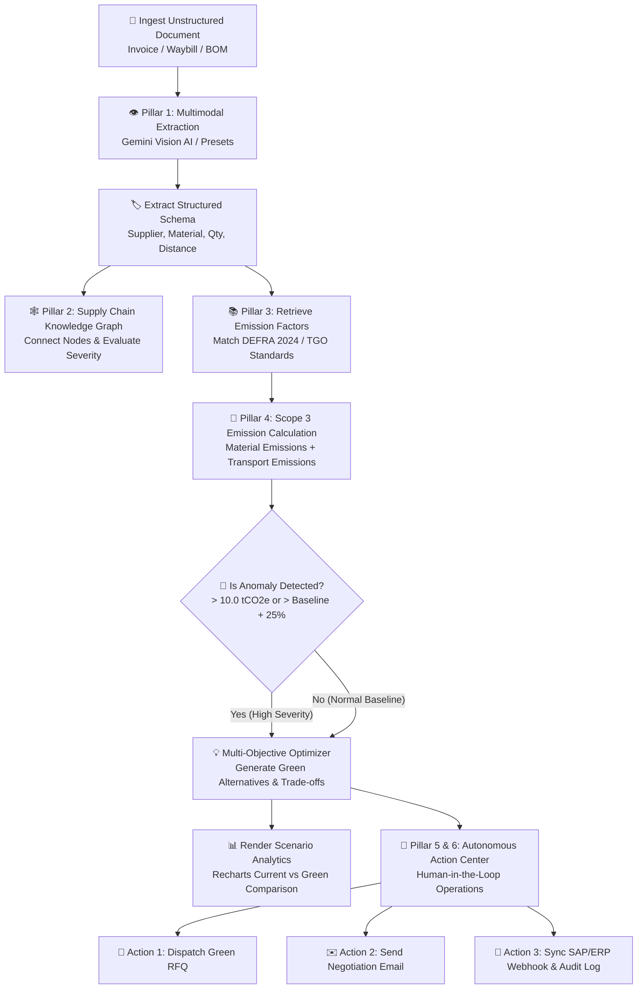

# 🌿 GreenScope Concierge
> **Autonomous Scope 3 Carbon Accounting & Green Procurement AI Agent**

GreenScope Concierge เป็นระบบ AI Agent อัจฉริยะที่ช่วยจัดการข้อมูลคาร์บอนฟุตพริ้นท์ของห่วงโซ่อุปทาน (Scope 3 GHG Emissions) แบบอัตโนมัติ ตั้งแต่การอ่านเอกสารทางธุรกิจ (Invoices, BOMs, Waybills), การสร้าง Supply Chain Knowledge Graph, การประเมินค่าความเสี่ยงด้านคาร์บอน ตามมาตรฐาน DEFRA/TGO ไปจนถึงการตัดสินใจดำเนินการแก้ไขปัญหาคาร์บอนสูงด้วยการเปิดจัดซื้อจัดจ้างสีเขียว (Green RFQ), เจรจากับคู่ค้า และเชื่อมต่อกับระบบวางแผนทรัพยากรองค์กร (ERP)

---

## 🚀 สรุปสิ่งที่พัฒนาเสร็จเรียบร้อยแล้ว (Completed Features)

### 1. 📥 Pillar 1: Understand (Multimodal Ingestion & Schema Extraction)
- **ระบบนำเข้าเอกสาร:** รองรับการอัปโหลดไฟล์ PDF/PNG/JPG (ใบกำกับสินค้า, ใบส่งของ, รายการวัตถุดิบ BOM)
- **Gemini Vision AI Engine:** ดึงข้อมูลโครงสร้าง JSON (Pydantic/TypeScript Schema) เช่น `supplierName`, `materialName`, `quantity`, `transportMode`, `distanceKm`, `totalCostUSD`
- **Preloaded Document Presets:** มีเอกสารจำลองพร้อมใช้งานทันที 3 รูปแบบ:
  1. *Supplier A - Virgin PP Plastic Invoice* ( High Carbon Anomaly: 17.35 tCO2e)
  2. *Supplier B - Recycled Polymer Waybill* ( Medium Carbon: 4.76 tCO2e)
  3. *Supplier C - Packaging Cardboard* ( Low Carbon: 2.89 tCO2e)
- **Dual View Inspector:** สามารถสลับดูได้ทั้งมุมมอง **Visual Invoice Card** และ **Raw Extracted JSON Schema**

### 2. 🕸️ Pillar 2: Remember & Connect (Dynamic Supply Chain Knowledge Graph)
- **Interactive SVG Knowledge Graph:** แสดงโครงข่ายความสัมพันธ์ระหว่าง **Suppliers**, **Materials**, **Logistics**, **Products**, และ **Carbon Footprint Scores**
- **Severity Color Coding:** แยกสีตามระดับความเสี่ยงด้านคาร์บอน (🔴 สีแดง = High Risk, 🟡 สีส้ม = Medium, 🟢 สีเขียว = Low)
- **Node Inspector & Edges:** กดเลือก Node เพื่อดูรายละเอียด แลกแสดงเส้นเชื่อมโยงแบบ `SUPPLIES`, `TRANSPORTED_BY`, `IN_PRODUCT`, `EMITS`

### 3. 📚 Pillar 3: Retrieve (GHG Emission Factor Lookup)
- **ฐานข้อมูลค่า Emission Factors Standard (DEFRA 2024 / TGO Standard):**
  - เม็ดพลาสติกบริสุทธิ์ Virgin PP Resin: `2.10 kgCO2e/kg`
  - เม็ดพลาสติกรีไซเคิล Post-Consumer rPP Resin: `0.78 kgCO2e/kg`
  - กล่องกระดาษ Corrugated Cardboard: `0.95 kgCO2e/kg`
  - ขนส่งทางบกด้วยรถบรรทุกดีเซล (Road Diesel Freight): `0.105 kgCO2e/tonne-km`
  - ขนส่งทางรถไฟไฟฟ้า (Electric Rail Freight): `0.028 kgCO2e/tonne-km`
- **Fuzzy Semantic Matching:** ระบบจับคู่ชื่อสินค้าและรูปแบบการขนส่งจากเอกสารเข้ากับค่ามาตรฐานอัตโนมัติ

### 4. 🧠 Pillar 4: Reason (Anomaly Detection & Multi-Objective Optimization)
- **การคำนวณคาร์บอนฟุตพริ้นท์:**
  $$\text{Total Emissions (kgCO2e)} = (\text{Quantity} \times \text{Material EF}) + (\text{Tonnage} \times \text{Distance} \times \text{Transport EF})$$
- **ระบบตรวจจับความผิดปกติ (Anomaly Alert):** แจ้งเตือนทันทีเมื่อปริมาณปล่อยคาร์บอนเกินเกณฑ์ `10.0 tCO2e` หรือเกินกว่าค่า Baseline 25%
- **Multi-Objective Trade-off Engine:** แนะนำทางเลือกจัดซื้อสีเขียว (เช่น *EcoPolymer Solutions Ltd* ที่ใช้เม็ด rPP ขนส่งด้วยรถไฟไฟฟ้า) พร้อมคำนวณเปรียบเทียบผลกระทบ:
  - 📉 ปริมาณคาร์บอนลดลง **-63.0% tCO2e**
  - 💰 ต้นทุนวัตถุดิบเปลี่ยนแปลง **+4.09% USD**
  - 🚚 ระยะเวลาส่งมอบ (Lead Time) **+1 วัน**
- **Recharts Scenario Analytics:** กราฟจำลองเปรียบเทียบระหว่างสภาวะปัจจุบัน (Current Baseline) กับสภาวะพึงประสงค์ (Green Scenario)

### 5. ⚡ Pillar 5 & 6: Act & Operational Copilot (Autonomous Action Center)
- **Action 1 - Green RFQ Generator:** ระบบสร้างเอกสารขอเสนอราคาการจัดซื้อจัดจ้างสีเขียว (Request for Quotation) แบบอัตโนมัติ พร้อมปุ่มอนุมัติส่งออก (Approve & Dispatch) และเอฟเฟกต์ฉลองความสำเร็จ Confetti
- **Action 2 - Diplomatic Negotiation Draft:** ระบบร่างอีเมลเจรจากับซัพพลายเออร์เดิม เพื่อขอใบรับรองรอยเท้าคาร์บอน (CFP Certificate) หรือขอปรับลดราคาเพื่อแข่งขันกับวัตถุดิบรีไซเคิล
- **Action 3 - Mock ERP Webhook Dispatcher:** จำลองการส่งข้อมูล Webhook API ไปยังระบบ SAP S/4HANA / NetSuite ERP เพื่ออัปเดตสถานะการสั่งซื้อพร้อม Audit Trail Log ย้อนหลัง

---

## 🔄 ภาพรวมการทำงานของระบบ (System Workflow Flowchart)



---

## 🛠️ เทคโนโลยีที่ใช้ (Tech Stack)

- **Frontend / Fullstack:** Next.js 16 (App Router, TypeScript), Tailwind CSS v4, Lucide React
- **Data Visualization:** Recharts (Interactive Bar & Scenario Analytics), Custom Animated SVG (Knowledge Graph)
- **AI Engine:** Google Gemini API (`@google/genai`) พร้อมระบบ Mock Fallback ป้องกันการขัดข้อง
- **UX & Effects:** Canvas Confetti (อนุมัติงานแบบซูเปอร์พรีเมียม), Toast Notifications

---

## 💻 วิธีการติดตั้งและใช้งาน (Getting Started)

### 1. ติดตั้ง Dependencies
```bash
npm install
```

### 2. กำหนดค่า Environment (Optional)
หากต้องการใช้ Google Gemini Vision API จริง สามารถสร้างไฟล์ `.env.local` ได้จากตัวอย่าง:
```bash
cp .env.local.example .env.local
```
*(หากไม่ใส่ API Key ระบบจะใช้ Mock Extraction Engine ที่ประมวลผลได้สมบูรณ์แบบ 100%)*

### 3. รัน Development Server
```bash
npm run dev
```
เปิดบราวเซอร์ไปที่ [http://localhost:3000](http://localhost:3000)

### 4. ทดสอบ Build สำหรับ Production
```bash
npm run build
```

---

## 📁 โครงสร้างไดเรกทอรีโครงการ (Project Structure)

```text
greenscope-poc/
├── src/
│   ├── app/
│   │   ├── api/extract/route.ts   # API Route สำหรับ Gemini Vision & Emissions Engine
│   │   ├── globals.css            # Dark Theme & Custom Scrollbars
│   │   ├── layout.tsx             # Root Layout & Typography Meta
│   │   └── page.tsx               # Main Dashboard Grid Layout (3 Panels)
│   ├── components/
│   │   ├── Header.tsx             # Brand, Scope 3 Status Badge, Quick Stats
│   │   ├── LeftPanel.tsx          # Multimodal Ingestion, Preset Selector, Visual Inspector
│   │   ├── KnowledgeGraph.tsx     # Interactive SVG Supply Chain Knowledge Graph
│   │   ├── AnalyticsPanel.tsx     # Recharts Scenario Bar Chart & EF Audit Database
│   │   ├── RightPanel.tsx         # AI Reasoning Insight Card, Action Center, Live Feed
│   │   └── ActionModals.tsx       # Modals สำหรับ Green RFQ, Email Draft, ERP Webhook
│   ├── data/
│   │   ├── emissionFactors.ts     # DEFRA 2024 & TGO Emission Factors Database
│   │   └── mockDocuments.ts       # Preset Documents (Virgin PP, rPP, Cardboard)
│   ├── lib/
│   │   ├── calculator.ts          # สูตรคำนวณ Scope 3, EF Matching & Optimization
│   │   └── gemini.ts              # Gemini Vision AI Extraction Service
│   └── types/
│       └── index.ts               # TypeScript Interfaces (Document, Graph, Alternative, Log)
├── README.md                      # เอกสารอธิบายโครงการและระบบการทำงาน
└── package.json
```
